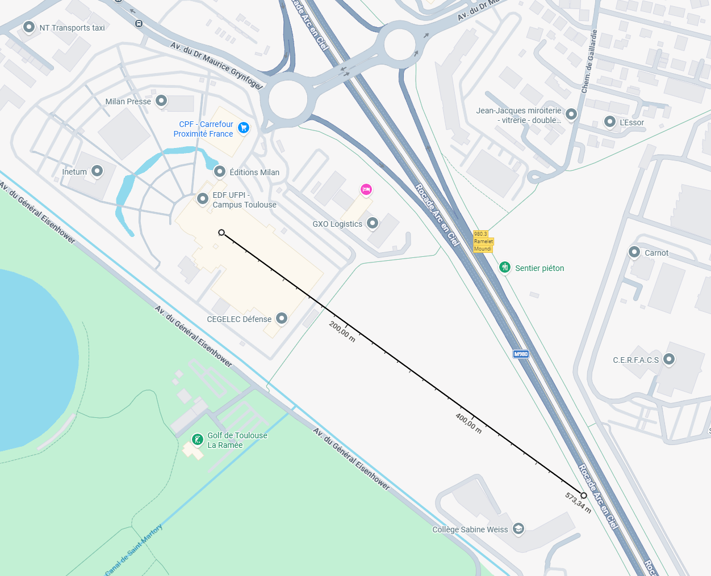
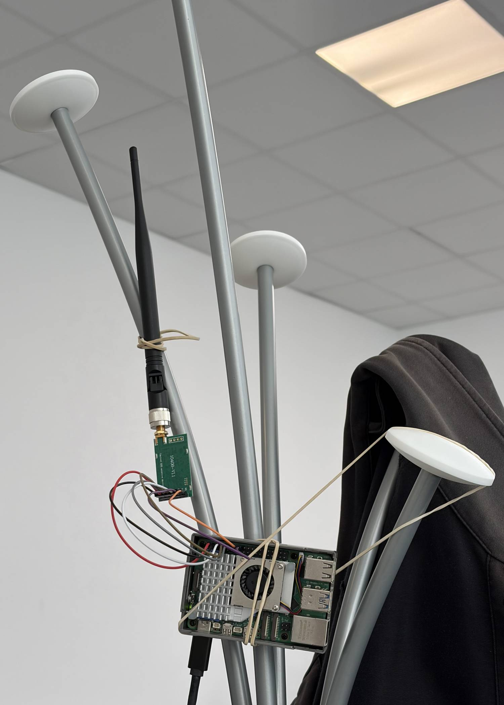

# LoRa over Raspberry Pi and ESP32

## LoRa between Raspberry Pi 5 and Raspberry Pi 5

Goal: send messages between 2 Raspberry Pi 5 using LoRa.

### Step 1: Connect LoRa Module

I use E220-400T30D module from Ebyte and I have a Raspberry Pi 5.
In order to connect the LoRa module to the Raspi I have to use the 40-pin GPIO (General Purpose Input Output).


And connect it the E220-400T30D LoRa module


Follow the following schema using Dupont cable to connect pins


To summarize

| LoRa Module Pins | Raspberry Pi 5 pins      |
|------------------|--------------------------|
| M0               | Pin 16 (GPIO 23)         |
| M1               | Pin 18 (GPIO 24)         |
| RXD              | Pin 8 (GPIO 14 TDX)      |
| TDX              | Pin 10 (GPIO 15 RDX)     |
| AUX              | Pin 12 (GPIO 18 PXM_CLK) |
| VCC              | Pin 4 (5V)               |
| GND              | Pin 6 (Ground)           |

!!! warning

    RDX on LoRa module is connected to TDX on Raspberry, this is normal. And vice-versa for TDX.

### Step 2: Configure Raspi

1. Connect to the raspi over ssh for example the run

    ```bash
    sudo raspi-config
    ```

2. Navigate to Interface Options:

    Use your arrow keys to select `3 Interface Options` and press Enter.

3. Select Serial Port:

    Find `I6 Serial Port` and press Enter.

4. Answer "No" to the Login Shell:

    The tool will ask: "Would you like a login shell to be accessible over serial?"
    Select `<No>`.

5. Answer "Yes" to Enable Hardware:

    The tool will then ask: "Would you like the serial port hardware to be enabled?"
    Select `<Yes>`.
    Why? This ensures the GPIO pins (8 and 10) are actually powered and assigned to the UART controller.

6. Finish and Reboot:

    Select `<Finish>` on the main menu.  
    Select `<Yes>` when it asks if you would like to reboot now.

7. Install dependencies

    ```bash
    sudo apt update -y && sudo apt install -y python3-dev liblgpio-dev
    ```

### Step 3: Configure LoRa Module

Install uv once on each raspi

```bash
curl -LsSf https://astral.sh/uv/install.sh | sh
```

Install dependencies, go in `DMX/docs/experimentation/code`

```bash
uv sync
```

In order to get RSSI and to set the same parameter such as UART rate (baud rate) and air date rate you have to flash to send a command to write the LoRa E220 module register.

To perform that, run on **both** receiver and sender:

```bash
uv run congigure_lora_register.py
```

### Step 4: Run the code

Go in `DMX/docs/experimentation/code` folder.

Then run `send.py` on one raspi and `receive.py`, one the other one.

```bash
uv run send.py
```

```bash
uv run receive.py
```

Then you should see on the receiver side:

```log
❯ uv run receive.py
--- Pi 5 LoRa Receiver Operational (RSSI Enabled) ---
[14:19:55] Message: Pi5 LoRa Message #1       | Signal: -9 dBm
[14:20:00] Message: Pi5 LoRa Message #2       | Signal: -10 dBm
[14:20:06] Message: Pi5 LoRa Message #3       | Signal: -10 dBm
^C
Stopping script...
```

!!! success

    Congratulation you have set up a LoRa connection between 2 Raspi.

### Step 5: Automate the script run at boot

Copy `lora-receiver.service` (or `lora-sender.service`) into `/etc/systemd/system/`

Then run load the new configuration with

```bash
sudo systemctl daemon-reload
```

And restart the service

```bash
sudo systemctl restart lora-receiver.service
```

or

```bash
sudo systemctl restart lora-sender.service
```

And to make it automatically start as boot:

```bash
sudo systemctl enable lora-receiver.service
```

or

```bash
sudo systemctl enable lora-sender.service
```

You can now check log thanks to

```bash
journalctl -u lora-receiver.service
```

or

```bash
journalctl -u lora-sender.service
```

### Debug

If message are not received make sure that both LoRa module have same configuration by executing `read_lora_register.py`.
Go in `DMX/docs/experimentation/code` folder.

```bash
uv run read_lora_register.py
```

### Test range 1

In order to test range I put the receiver in the Neusta office and I walk out to see how far it carries.

Here is the config:

??? info "Show config"

    ```log
    Switching to Configuration mode (M0=1, M1=1)...
    Sending read command: C10008
    Raw response received: C100080000622012800000
    ----------------------------------------
    CURRENT MODULE CONFIGURATION
    ----------------------------------------
    Module Address      : 0x0000 (0)
    Frequency (Channel) : 428.125 MHz (Channel 18)
    UART Speed          : 9600 bps
    Serial Parity       : 8N1
    Air Speed (LoRa)    : 2.4k bps
    Packet Size         : 200 bytes
    TX Power            : 30dBm
    Transmission Mode   : Transparent
    Ambient RSSI (LBT)  : Enabled
    RSSI at end of msg  : Enabled
    LBT (Listen Before) : Disabled
    WOR Cycle           : 500ms
    ----------------------------------------
    Resetting pins to Normal mode (M0=0, M1=0)...
    Resources released.
    ```

Here are the logs:

??? info "Show logs"

    ```log
    --8<-- "docs/experimentation/logs/walkout-1.log"
    ```

There is a small artifact at the beginning, the `-256 dBm` RSSI is irrelevant. However, all other RSSI looks relevant in comparison to how far I was from the sender.
We can observe that some packets are missing probably due to interferences.

According to Google Maps I walked up to 278 m from the sender and I got around -68 dBm there.


The theoretical range of these modules are up to 10 km, under ideal condition.

### Test range 2

This second test pushes the LoRa module to its limits. I took the sender with me and walked to see at what point the signal was lost. I noticed that the signal dropped around this location:



It should be taken into account that this is not an open field; the receiver is inside a building, placed on a desk (about one meter high) with the antenna positioned vertically. The sender is on my backpack with the antenna positioned vertically too.

??? info "Show logs (not completed)"

    ``` title="walkout-2.log"
    --8<-- "docs/experimentation/logs/walkout-2.log"
    ```

**Analyze**: The LoRa module is supposed to received up to **-140 dBm** nevertheless I stop receiving as **-72 dBm**. So there is something. The most probable is the Fresnel zone that said that the signal is like an ellipsoid between sender and receiver, so ground absorb a lot of the signal strength. I will try to put the receiver upper to see if there is any difference.

### Test range 3

I put the LoRa upper of one meter thanks to a coat rack



However, the maximum range remains the same. I also try to go on a different location, but I also loose the signal around 500 meter after reaching **-72 dBm**.
