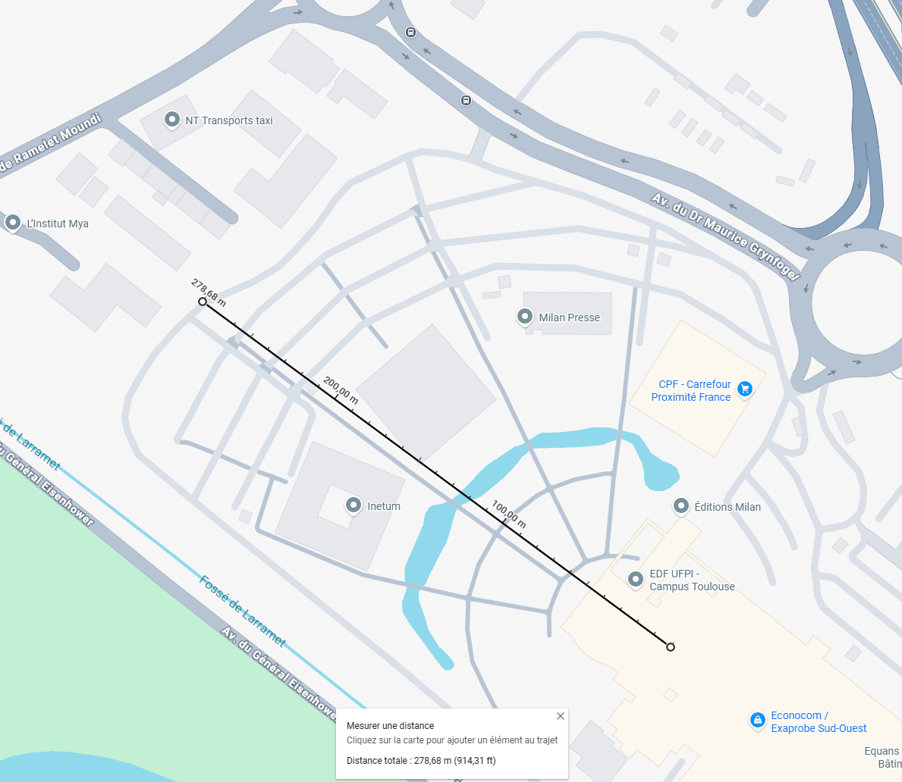

# LoRa over Raspberry Pi and ESP32

## LoRa between Raspberry Pi 5 and Raspberry Pi 5

Goal: send messages between 2 Raspberry Pi 5 using LoRa.

### Step 1: Connect LoRa Module

I use E220-400T30D module from Ebyte and I have a Raspberry Pi 5.
In order to connect the LoRa module to the Raspi I have to use the 40-pin GPIO (General Purpose Input Output).


And connect it the E220-400T30D LoRa module


Follow the following schema using Dupont cable to connect pins


To summarize

| LoRa Module Pins | Raspberry Pi 5 pins      |
|------------------|--------------------------|
| M0               | Pin 16 (GPIO 23)         |
| M1               | Pin 18 (GPIO 24)         |
| RXD              | Pin 8 (GPIO 14 TDX)      |
| TDX              | Pin 10 (GPIO 15 RDX)     |
| AUX              | Pin 12 (GPIO 18 PXM_CLK) |
| VCC              | Pin 4 (5V)               |
| GND              | Pin 6 (Ground)           |

!!! warning

    RDX on LoRa module is connected to TDX on Raspberry, this is normal. And vice-versa for TDX.

### Step 2: Configure Raspi

1. Connect to the raspi over ssh for example the run

    ```bash
    sudo raspi-config
    ```

2. Navigate to Interface Options:

    Use your arrow keys to select `3 Interface Options` and press Enter.

3. Select Serial Port:

    Find `I6 Serial Port` and press Enter.

4. Answer "No" to the Login Shell:

    The tool will ask: "Would you like a login shell to be accessible over serial?"
    Select `<No>`.

5. Answer "Yes" to Enable Hardware:

    The tool will then ask: "Would you like the serial port hardware to be enabled?"
    Select `<Yes>`.
    Why? This ensures the GPIO pins (8 and 10) are actually powered and assigned to the UART controller.

6. Finish and Reboot:

    Select `<Finish>` on the main menu.  
    Select `<Yes>` when it asks if you would like to reboot now.

7. Install dependencies

    ```bash
    sudo apt update -y && sudo apt install -y python3-dev liblgpio-dev
    ```

### Step 3: Configure LoRa Module

Install uv once on each raspi

```bash
curl -LsSf https://astral.sh/uv/install.sh | sh
```

Install dependencies, go in `DMX/docs/experimentation/code`

```bash
uv sync
```

In order to get RSSI and to set the same parameter such as UART rate (baud rate) and air date rate you have to flash to send a command to write the LoRa E220 module register.

To perform that, run on **both** receiver and sender:

```bash
uv run congigure_lora_register.py
```

### Step 4: Run the code

Go in `DMX/docs/experimentation/code` folder.

Then run `send.py` on one raspi and `receive.py`, one the other one.

```bash
uv run send.py
```

```bash
uv run receive.py
```

Then you should see on the receiver side:

```log
❯ uv run receive.py
--- Pi 5 LoRa Receiver Operational (RSSI Enabled) ---
[14:19:55] Message: Pi5 LoRa Message #1       | Signal: -9 dBm
[14:20:00] Message: Pi5 LoRa Message #2       | Signal: -10 dBm
[14:20:06] Message: Pi5 LoRa Message #3       | Signal: -10 dBm
^C
Stopping script...
```

!!! success

    Congratulation you have set up a LoRa connection between 2 Raspi.

### Debug

If message are not received make sure that both LoRa module have same configuration by executing `read_lora_register.py`.
Go in `DMX/docs/experimentation/code` folder.

```bash
uv run read_lora_register.py
```

### Test range

In order to test range I put the receiver in the Neusta office and I walk out to see how far it carries.

Here is the config:

??? info "Show config"

    ```log
    Switching to Configuration mode (M0=1, M1=1)...
    Sending read command: C10008
    Raw response received: C100080000622012800000
    ----------------------------------------
    CURRENT MODULE CONFIGURATION
    ----------------------------------------
    Module Address      : 0x0000 (0)
    Frequency (Channel) : 428.125 MHz (Channel 18)
    UART Speed          : 9600 bps
    Serial Parity       : 8N1
    Air Speed (LoRa)    : 2.4k bps
    Packet Size         : 200 bytes
    TX Power            : 30dBm
    Transmission Mode   : Transparent
    Ambient RSSI (LBT)  : Enabled
    RSSI at end of msg  : Enabled
    LBT (Listen Before) : Disabled
    WOR Cycle           : 500ms
    ----------------------------------------
    Resetting pins to Normal mode (M0=0, M1=0)...
    Resources released.
    ```

Here are the logs:

??? info "Show logs"

    ```log
    [10:35:54] Message: Pi5 LoRa Message #1       | Signal: -256 dBm
    [10:35:59] Message: Pi5 LoRa Message #2       | Signal: -10 dBm
    [10:36:04] Message: Pi5 LoRa Message #3       | Signal: -256 dBm
    [10:36:10] Message: Pi5 LoRa Message #4       | Signal: -256 dBm
    [10:36:15] Message: Pi5 LoRa Message #5       | Signal: -256 dBm
    [10:36:20] Message: Pi5 LoRa Message #6       | Signal: -256 dBm
    [10:36:26] Message: Pi5 LoRa Message #7       | Signal: -256 dBm
    [10:36:31] Message: Pi5 LoRa Message #8       | Signal: -256 dBm
    [10:36:37] Message: Pi5 LoRa Message #9       | Signal: -256 dBm
    [10:36:42] Message: Pi5 LoRa Message #10      | Signal: -27 dBm
    [10:36:47] Message: Pi5 LoRa Message #11      | Signal: -9 dBm
    [10:36:53] Message: Pi5 LoRa Message #12      | Signal: -6 dBm
    [10:36:58] Message: Pi5 LoRa Message #13      | Signal: -8 dBm
    [10:37:03] Message: Pi5 LoRa Message #14      | Signal: -11 dBm
    [10:37:09] Message: Pi5 LoRa Message #15      | Signal: -1 dBm
    [10:37:14] Message: Pi5 LoRa Message #16      | Signal: -256 dBm
    [10:37:19] Message: Pi5 LoRa Message #17      | Signal: -8 dBm
    [10:37:25] Message: Pi5 LoRa Message #18      | Signal: -21 dBm
    [10:37:30] Message: Pi5 LoRa Message #19      | Signal: -34 dBm
    [10:37:35] Message: Pi5 LoRa Message #20      | Signal: -42 dBm
    [10:37:41] Message: Pi5 LoRa Message #21      | Signal: -43 dBm
    [10:37:46] Message: Pi5 LoRa Message #22      | Signal: -32 dBm
    [10:37:52] Message: Pi5 LoRa Message #23      | Signal: -34 dBm
    [10:37:57] Message: Pi5 LoRa Message #24      | Signal: -30 dBm
    [10:38:02] Message: Pi5 LoRa Message #25      | Signal: -30 dBm
    [10:38:08] Message: Pi5 LoRa Message #26      | Signal: -34 dBm
    [10:38:13] Message: Pi5 LoRa Message #27      | Signal: -31 dBm
    [10:38:18] Message: Pi5 LoRa Message #28      | Signal: -38 dBm
    [10:38:24] Message: Pi5 LoRa Message #29      | Signal: -49 dBm
    [10:38:29] Message: Pi5 LoRa Message #30      | Signal: -41 dBm
    [10:38:34] Message: Pi5 LoRa Message #31      | Signal: -44 dBm
    [10:38:40] Message: Pi5 LoRa Message #32      | Signal: -41 dBm
    [10:38:45] Message: Pi5 LoRa Message #33      | Signal: -55 dBm
    [10:38:50] Message: Pi5 LoRa Message #34      | Signal: -59 dBm
    [10:38:56] Message: Pi5 LoRa Message #35      | Signal: -71 dBm
    [10:39:01] Message: Pi5 LoRa Message #36      | Signal: -42 dBm
    [10:39:06] Message: Pi5 LoRa Message #37      | Signal: -45 dBm
    [10:39:12] Message: Pi5 LoRa Message #38      | Signal: -38 dBm
    [10:39:17] Message: Pi5 LoRa Message #39      | Signal: -36 dBm
    [10:39:23] Message: Pi5 LoRa Message #40      | Signal: -38 dBm
    [10:39:28] Message: Pi5 LoRa Message #41      | Signal: -36 dBm
    [10:39:33] Message: Pi5 LoRa Message #42      | Signal: -47 dBm
    [10:39:39] Message: Pi5 LoRa Message #43      | Signal: -37 dBm
    [10:39:44] Message: Pi5 LoRa Message #44      | Signal: -32 dBm
    [10:39:49] Message: Pi5 LoRa Message #45      | Signal: -38 dBm
    [10:39:55] Message: Pi5 LoRa Message #46      | Signal: -52 dBm
    [10:40:00] Message: Pi5 LoRa Message #47      | Signal: -42 dBm
    [10:40:05] Message: Pi5 LoRa Message #48      | Signal: -45 dBm
    [10:40:11] Message: Pi5 LoRa Message #49      | Signal: -59 dBm
    [10:40:16] Message: Pi5 LoRa Message #50      | Signal: -56 dBm
    [10:40:21] Message: Pi5 LoRa Message #51      | Signal: -53 dBm
    [10:40:32] Message: Pi5 LoRa Message #53      | Signal: -54 dBm
    [10:40:38] Message: Pi5 LoRa Message #54      | Signal: -57 dBm
    [10:40:43] Message: Pi5 LoRa Message #55      | Signal: -53 dBm
    [10:40:48] Message: Pi5 LoRa Message #56      | Signal: -52 dBm
    [10:40:54] Message: Pi5 LoRa Message #57      | Signal: -59 dBm
    [10:40:59] Message: Pi5 LoRa Message #58      | Signal: -55 dBm
    [10:41:04] Message: Pi5 LoRa Message #59      | Signal: -61 dBm
    [10:41:10] Message: Pi5 LoRa Message #60      | Signal: -52 dBm
    [10:41:20] Message: Pi5 LoRa Message #62      | Signal: -46 dBm
    [10:41:26] Message: Pi5 LoRa Message #63      | Signal: -54 dBm
    [10:41:31] Message: Pi5 LoRa Message #64      | Signal: -53 dBm
    [10:41:58] Message: Pi5 LoRa Message #69      | Signal: -52 dBm
    [10:42:03] Message: Pi5 LoRa Message #70      | Signal: -59 dBm
    [10:42:09] Message: Pi5 LoRa Message #71      | Signal: -58 dBm
    [10:42:14] Message: Pi5 LoRa Message #72      | Signal: -57 dBm
    [10:42:19] Message: Pi5 LoRa Message #73      | Signal: -63 dBm
    [10:42:30] Message: Pi5 LoRa Message #75      | Signal: -64 dBm
    [10:42:35] Message: Pi5 LoRa Message #76      | Signal: -64 dBm
    [10:42:41] Message: Pi5 LoRa Message #77      | Signal: -63 dBm
    [10:42:46] Message: Pi5 LoRa Message #78      | Signal: -57 dBm
    [10:43:02] Message: Pi5 LoRa Message #81      | Signal: -59 dBm
    [10:43:08] Message: Pi5 LoRa Message #82      | Signal: -60 dBm
    [10:43:13] Message: Pi5 LoRa Message #83      | Signal: -69 dBm
    [10:43:18] Message: Pi5 LoRa Message #84      | Signal: -68 dBm
    [10:43:24] Message: Pi5 LoRa Message #85      | Signal: -71 dBm
    [10:43:29] Message: Pi5 LoRa Message #86      | Signal: -61 dBm
    [10:43:40] Message: Pi5 LoRa Message #88      | Signal: -60 dBm
    [10:43:45] Message: Pi5 LoRa Message #89      | Signal: -58 dBm
    [10:43:50] Message: Pi5 LoRa Message #90      | Signal: -68 dBm
    [10:43:56] Message: Pi5 LoRa Message #91      | Signal: -71 dBm
    [10:44:01] Message: Pi5 LoRa Message #92      | Signal: -60 dBm
    [10:44:06] Message: Pi5 LoRa Message #93      | Signal: -63 dBm
    [10:44:12] Message: Pi5 LoRa Message #94      | Signal: -60 dBm
    [10:44:22] Message: Pi5 LoRa Message #96      | Signal: -68 dBm
    [10:44:33] Message: Pi5 LoRa Message #98      | Signal: -67 dBm
    [10:44:44] Message: Pi5 LoRa Message #100     | Signal: -55 dBm
    [10:45:00] Message: Pi5 LoRa Message #103     | Signal: -58 dBm
    [10:45:05] Message: Pi5 LoRa Message #104     | Signal: -61 dBm
    [10:45:32] Message: Pi5 LoRa Message #109     | Signal: -64 dBm
    [10:45:38] Message: Pi5 LoRa Message #110     | Signal: -63 dBm
    [10:45:48] Message: Pi5 LoRa Message #112     | Signal: -63 dBm
    [10:45:54] Message: Pi5 LoRa Message #113     | Signal: -64 dBm
    [10:45:59] Message: Pi5 LoRa Message #114     | Signal: -64 dBm
    [10:46:04] Message: Pi5 LoRa Message #115     | Signal: -61 dBm
    [10:46:15] Message: Pi5 LoRa Message #117     | Signal: -64 dBm
    [10:46:20] Message: Pi5 LoRa Message #118     | Signal: -65 dBm
    [10:46:26] Message: Pi5 LoRa Message #119     | Signal: -63 dBm
    [10:46:31] Message: Pi5 LoRa Message #120     | Signal: -63 dBm
    [10:46:37] Message: Pi5 LoRa Message #121     | Signal: -57 dBm
    [10:46:42] Message: Pi5 LoRa Message #122     | Signal: -62 dBm
    [10:46:47] Message: Pi5 LoRa Message #123     | Signal: -64 dBm
    [10:46:53] Message: Pi5 LoRa Message #124     | Signal: -59 dBm
    [10:46:58] Message: Pi5 LoRa Message #125     | Signal: -63 dBm
    [10:47:03] Message: Pi5 LoRa Message #126     | Signal: -59 dBm
    [10:47:09] Message: Pi5 LoRa Message #127     | Signal: -60 dBm
    [10:47:14] Message: Pi5 LoRa Message #128     | Signal: -64 dBm
    [10:47:19] Message: Pi5 LoRa Message #129     | Signal: -65 dBm
    [10:47:25] Message: Pi5 LoRa Message #130     | Signal: -68 dBm
    [10:47:30] Message: Pi5 LoRa Message #131     | Signal: -66 dBm
    [10:47:36] Message: Pi5 LoRa Message #132     | Signal: -59 dBm
    [10:47:41] Message: Pi5 LoRa Message #133     | Signal: -59 dBm
    [10:47:46] Message: Pi5 LoRa Message #134     | Signal: -61 dBm
    [10:47:52] Message: Pi5 LoRa Message #135     | Signal: -62 dBm
    [10:47:57] Message: Pi5 LoRa Message #136     | Signal: -57 dBm
    [10:48:02] Message: Pi5 LoRa Message #137     | Signal: -56 dBm
    [10:48:08] Message: Pi5 LoRa Message #138     | Signal: -57 dBm
    [10:48:13] Message: Pi5 LoRa Message #139     | Signal: -53 dBm
    [10:48:18] Message: Pi5 LoRa Message #140     | Signal: -51 dBm
    [10:48:24] Message: Pi5 LoRa Message #141     | Signal: -54 dBm
    [10:48:29] Message: Pi5 LoRa Message #142     | Signal: -51 dBm
    [10:48:35] Message: Pi5 LoRa Message #143     | Signal: -48 dBm
    [10:48:40] Message: Pi5 LoRa Message #144     | Signal: -46 dBm
    [10:48:45] Message: Pi5 LoRa Message #145     | Signal: -37 dBm
    [10:48:51] Message: Pi5 LoRa Message #146     | Signal: -30 dBm
    [10:48:56] Message: Pi5 LoRa Message #147     | Signal: -52 dBm
    [10:49:01] Message: Pi5 LoRa Message #148     | Signal: -28 dBm
    [10:49:07] Message: Pi5 LoRa Message #149     | Signal: -30 dBm
    [10:49:12] Message: Pi5 LoRa Message #150     | Signal: -32 dBm
    [10:49:17] Message: Pi5 LoRa Message #151     | Signal: -34 dBm
    [10:49:23] Message: Pi5 LoRa Message #152     | Signal: -34 dBm
    [10:49:28] Message: Pi5 LoRa Message #153     | Signal: -14 dBm
    [10:49:34] Message: Pi5 LoRa Message #154     | Signal: -4 dBm
    [10:49:39] Message: Pi5 LoRa Message #155     | Signal: -8 dBm
    [10:49:44] Message: Pi5 LoRa Message #156     | Signal: -2 dBm
    [10:49:50] Message: Pi5 LoRa Message #157     | Signal: -6 dBm
    [10:49:55] Message: Pi5 LoRa Message #158     | Signal: -1 dBm
    [10:50:00] Message: Pi5 LoRa Message #159     | Signal: -3 dBm
    [10:50:06] Message: Pi5 LoRa Message #160     | Signal: -4 dBm
    [10:50:11] Message: Pi5 LoRa Message #161     | Signal: -1 dBm
    [10:50:16] Message: Pi5 LoRa Message #162     | Signal: -1 dBm
    [10:50:22] Message: Pi5 LoRa Message #163     | Signal: -2 dBm
    [10:50:27] Message: Pi5 LoRa Message #164     | Signal: -3 dBm
    [10:50:33] Message: Pi5 LoRa Message #165     | Signal: -10 dBm
    [10:50:38] Message: Pi5 LoRa Message #166     | Signal: -5 dBm
    ^C
    Stopping script...
    ```

There is a small artifact at the beginning, the `-256 dBm` RSSI is irrelevant. However, all other RSSI looks relevant in comparison to how far I was from the sender.
We can observe that some packets are missing probably due to interferences.

According to Google Maps I walked up to 278 m from the sender and I got around -68 dBm there.



The theoretical range of these modules are up to 10 km, under ideal condition.
