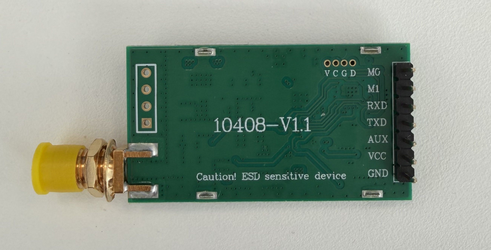
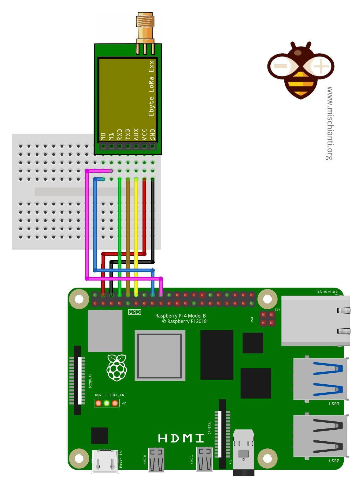

# LoRa over Raspberry Pi and ESP32

## LoRa between Raspberry Pi 5 and Raspberry Pi 5

Goal: send messages between 2 Raspberry Pi 5 using LoRa.

### Step 1: Connect LoRa Module

I use E220-400T30D module from Ebyte and I have a Raspberry Pi 5.
In order to connect the LoRa module to the Raspi I have to use the 40-pin GPIO (General Purpose Input Output).


And connect it the E220-400T30D LoRa module



Follow the following schema using Dupont cable to connect pins



To summarize

| LoRa Module Pins | Raspberry Pi 5 pins      |
|------------------|--------------------------|
| M0               | Pin 16 (GPIO 23)         |
| M1               | Pin 18 (GPIO 24)         |
| RXD              | Pin 8 (GPIO 14 TDX)      |
| TDX              | Pin 10 (GPIO 15 RDX)     |
| AUX              | Pin 12 (GPIO 18 PXM_CLK) |
| VCC              | Pin 4 (5V)               |
| GND              | Pin 6 (Ground)           |

!!! warning

    RDX on LoRa module is connected to TDX on Raspberry, this is normal. And vice-versa for TDX.

### Step 2: Configure Raspi

1. Connect to the raspi over ssh for example the run

    ```bash
    sudo raspi-config
    ```

2. Navigate to Interface Options:

    Use your arrow keys to select `3 Interface Options` and press Enter.

3. Select Serial Port:

    Find `I6 Serial Port` and press Enter.

4. Answer "No" to the Login Shell:

    The tool will ask: "Would you like a login shell to be accessible over serial?"
    Select `<No>`.

5. Answer "Yes" to Enable Hardware:

    The tool will then ask: "Would you like the serial port hardware to be enabled?"
    Select `<Yes>`.
    Why? This ensures the GPIO pins (8 and 10) are actually powered and assigned to the UART controller.

6. Finish and Reboot:

    Select `<Finish>` on the main menu.  
    Select `<Yes>` when it asks if you would like to reboot now.

7. Install dependencies

    ```bash
    sudo apt update -y && sudo apt install -y python3-dev liblgpio-dev
    ```

### Step 3: Configure LoRa Module

In order to get RSSI and to set the same parameter such as UART rate (baud rate) and air date rate you have to flash the send a commande to write the LoRa E220 module register.

To perform that, run 

```bash
uv run 
```

### Step 3: Run the code

Install uv

```bash
curl -LsSf https://astral.sh/uv/install.sh | sh
```

Go on `lora_receiver` and `lora_sender` under the `code` folder.

Install dependencies

```bash
uv sync
```

Then run both script, one on each Raspi

```bash
uv run main.py
```

Then you should see on the receiver side:

```log
pi@lora2:~/lora_receiver $ uv run main.py
--- Pi 5 LoRa Diagnostic Receiver ---
Pins Set: M0(BCM23)=LOW, M1(BCM24)=LOW
Connected to /dev/ttyAMA0 at 9600 baud.
Waiting for data... (Press Ctrl+C to stop)
DEBUG: AUX Pin went LOW (Module is busy/receiving!)
DEBUG: AUX Pin went LOW (Module is busy/receiving!)
Received String: Pi5 LoRa Message #0
DEBUG: AUX Pin went LOW (Module is busy/receiving!)
Received String: Pi5 LoRa Message #1
Received String: Pi5 LoRa Message
Received String: #2
Received String: Pi5 LoRa Message #3
Received String: Pi5 LoRa Message #4
Received String: Pi5 LoRa Message #5
```

!!! success

    Congratulation you have set up a LoRa connection between 2 Raspi.
