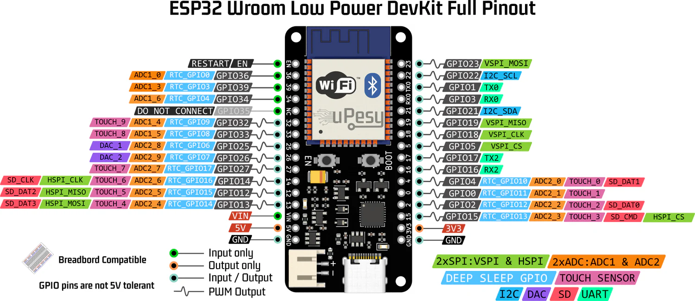
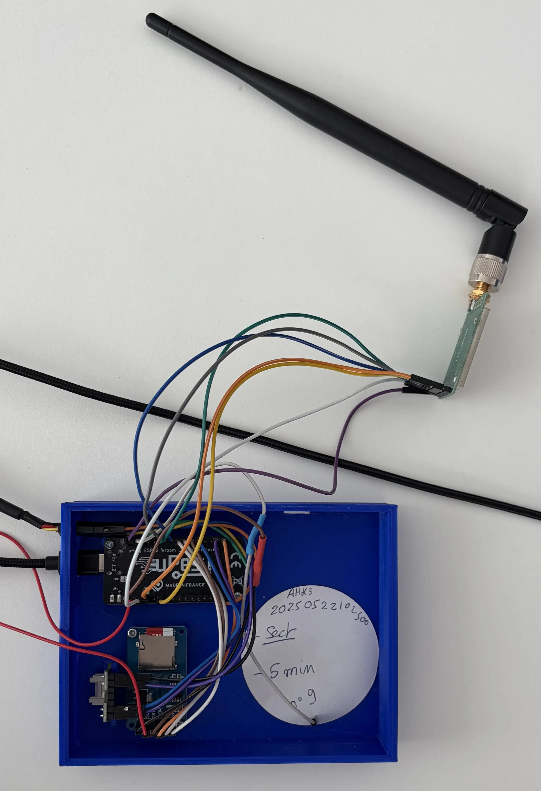
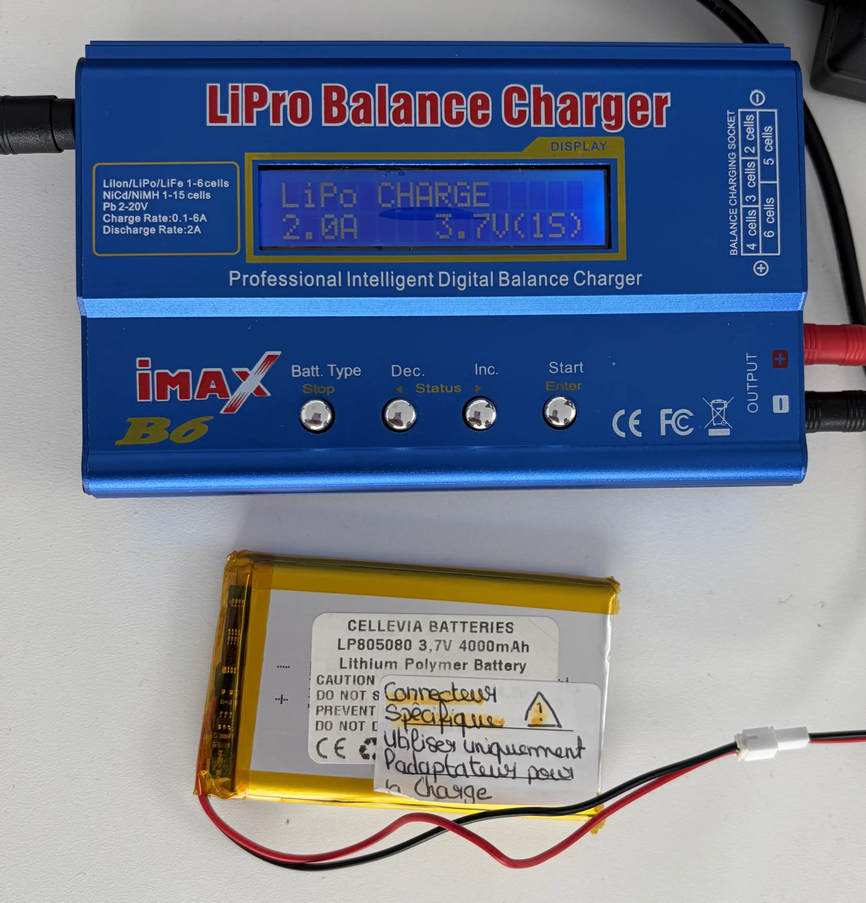
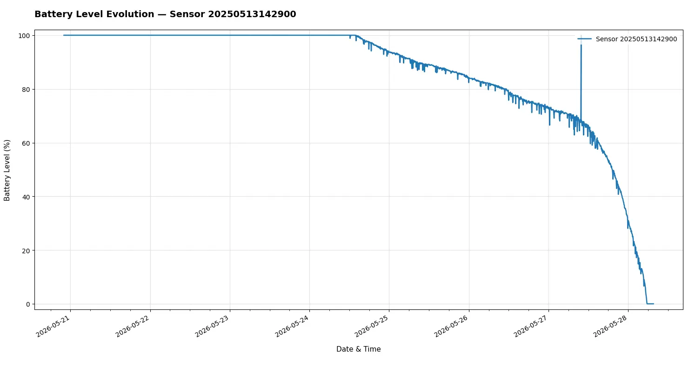
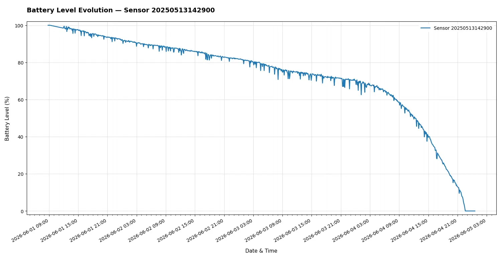
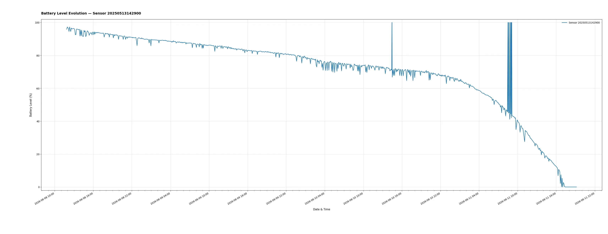
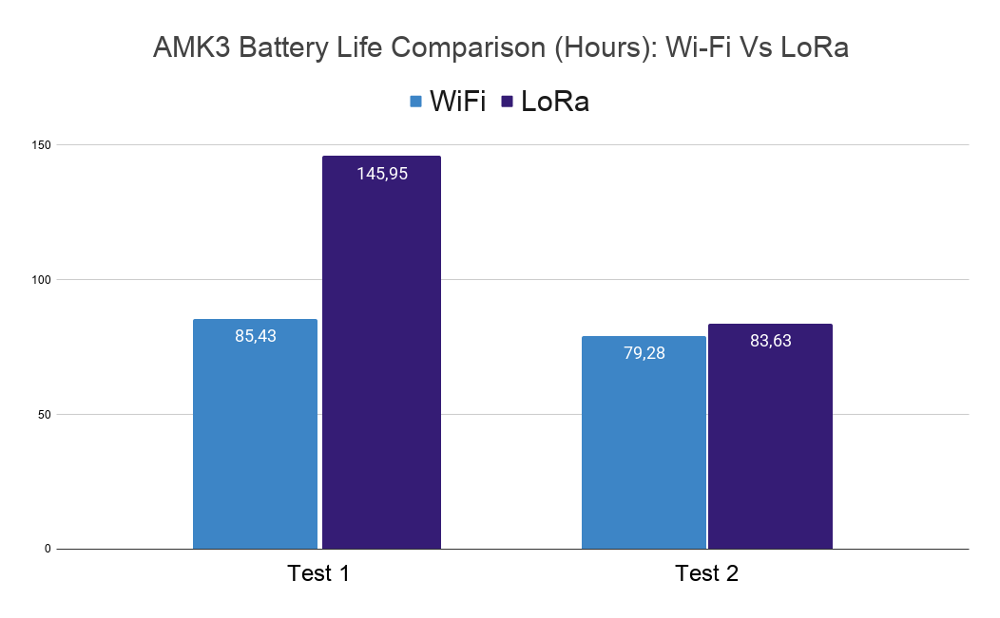

# LoRa between ESP32 and Raspberry Pi 5 (draft)

**Goal**: Use an ESP32 to send Aquacheck sensor data to a Raspberry Pi 5 gateway using LoRa. The Raspberry Pi will send sensing data to the MQTT AWS server through internet using Wi-Fi or Ethernet.

**Goal 2**: Compare the battery longevity of current Wi-Fi-based Aquacheck sensors against LoRa-based configurations to evaluate power efficiency.

## Sensor using Wi-Fi: issues

Currently, the Aquacheck sensor use ESP32 Wi-Fi to send his data to the MQTT AWS server. This is not ideal in terms of energy consumption for the following reason:

- At each wake-up (every 5 minutes) the ESP32 has to scan Wi-Fi networks, connect to the good one, wait for an IP address (DHCP). It can take seconds when radio interface is active and radio interface is what consume the most in a sensor.
- Wi-Fi consume more the other IoT oriented radio technology such as LoRa, Zigbee or Bluetooth Low Energy (BLE).
- TLS connection between ESP and AWS server involved handshake, encryption, and certificates which add overhead of data to transmit over the radio and CPU usage.

Using LoRa will reduce these problems.

## Experimentation details

To perform a comparison I will put the nominal Aquacheck on battery and measure the lifetime. Then I will use the same Aquacheck with the same battery in the same place and measure the lifetime. The only difference will be the code that no longer rely on Wi-Fi but on LoRa. The sleep cycle will remain the same. The idea is to measure approximately the difference of lifetime between Wi-Fi and LoRa not to perform a precise experimentation over dozen of sensors.

## Hardware used

- uPesy ESP32 Wroom Low Power DevKit (x1)
- E220-400T30D module from Ebyte (x2)
- Raspberry Pi 5 (x1)

## Connection ESP32 — LoRa

Pin connection tables

| LoRa Module Pins | ESP32 Wroom Low Power Dev Kit |
| ---------------- | ----------------------------- |
| M0               | GPIO 13                       |
| M1               | GPIO 14                       |
| RXD              | GPIO 17 (TX2)                 |
| TDX              | GPIO 16 (RX2)                 |
| AUX              | GPIO 4                        |
| VCC              | VIN                           |
| GND              | GND                           |

## Gateway script: `receive-and-send-to-aws.py`

This script runs on the **Raspberry Pi 5** and acts as a **LoRa-to-cloud gateway** for Aquacheck sensors.

On startup it connects to **AWS IoT Core** over MQTT (port 8883, TLS with device certificates), then listens on the E220 module via UART (`/dev/ttyAMA0`, normal mode with M0/M1 low). Each incoming LoRa frame is read as a text line followed by one RSSI byte (same E220 convention as the Pi–Pi experiments).

The payload from the ESP32 is a semicolon-separated CSV string (`boitier_id; temperature; humidity; soil moisture; battery`). The script parses these fields, stamps the message with the **local reception time** (ISO 8601), computes **humidex** using the same formulas as the Aquacheck firmware, builds a JSON object (`type`, `ID`, sensor values, `humidex`, `batteryLevel`), and publishes it to the `aquacheck/pub` topic on AWS (QoS 1). Received messages and signal strength are logged to the console.

Source: [`code/receive-and-send-to-aws.py`](code/receive-and-send-to-aws.py).

!!! important

    If you have issue during configuration with something like `[LoRa] Réponse config (HEX) : FF FF FF FF`. Try unplug and replug VCC and  GND cable of LoRa module.

## Aquacheck LoRa branch

To run this architecture, I created a **new branch** on the **Aquacheck** firmware repository. That branch replaces the Wi-Fi/MQTT path with **LoRa**: the ESP32 wakes on the same schedule, reads the sensors, and sends a compact CSV frame to the E220 module. The **Raspberry Pi 5** receives it and forwards data to AWS via [`receive-and-send-to-aws.py`](code/receive-and-send-to-aws.py).

In this setup, the **Aquacheck unit no longer uses Wi-Fi at all** and does **not need Internet** to operate. Only the gateway Pi must be online (Wi-Fi or Ethernet) to reach AWS IoT Core.

One deliberate change on the cloud side: the **`timestamp` is no longer set on the Aquacheck** at transmission time, but **on the Raspberry Pi** when the LoRa frame is received and published. In practice this shifts the recorded time by only a few seconds (LoRa air time plus gateway processing), which is negligible for soil monitoring and battery-life comparison.

The purpose of this branch is to **compare the stock Wi-Fi firmware with the LoRa variant** on the **same hardware and battery**, keeping the sleep cycle unchanged, in order to see **which configuration lasts longer** before the battery is depleted.

## Experimentation: Wi-Fi Aquacheck Mk3 Battery longevity test

Battery setting:

!!! important

    I notice that charging LiPo battery with this charger producde pretty random charging level in output. what the charger call full is not always the say. To counteract that I measure the tension of the battery before I run a test.

### Test 1 — Wi-Fi

In this first test, I charge a battery and plug it into *Aquacheck 4* with the stock Wi-Fi firmware to measure battery longevity.

- Start time: **21/05/2026 4:00 PM UTC+2**
- Stop time: **28/05/2026 9:35 AM UTC+2**
- Total duration: **6 days, 19 hours and 35 minutes**
- Battery used: **A**
- Aquacheck number: **4**
- Aquacheck ID: **20250522102500**

!!! info

    The soil sensor was not on the soil so only humidity and temperature were sensed

!!! warning

    Data in this test looks weird and irelevant, something probably went wrong. It shoud be ignored.

### Test 2 — Wi-Fi

In this second test, I use the same battery, the same voltage and the same Aquacheck. I just put the soil sensor into water to see if that change something.

- Start time: **01/06/2026 09:00 AM UTC+2**
- Stop time: **04/06/2026 10:25 PM UTC+2**
- Total duration: **3 days, 13 hours and 25 minutes**
- Battery used: **A**
- Aquacheck number: **4**
- Aquacheck ID: **20250522102500**

### Test 3 — Wi-Fi

- Type: Wi-Fi
- Start time: **08/06/2026 01:51 PM UTC+2**
- Stop time: **11/06/2026 9:08 PM UTC+2**
- Total duration: **3 days, 7 hours and 17 minutes.**
- Battery used: **A**
- Aquacheck number: **4**
- Aquacheck ID: **20250522102500**

### Test 4 — Wi-Fi

- Type: Wi-Fi
- Start time: **25/06/2026 04:51 PM UTC+2**
- Stop time: **04/07/2026 04:46 PM UTC+2**
- Total duration: **8 days, 23 hours, and 55 minutes**
- Battery used: **A**
- Battery tension just before it start: **4.01V**
- Battery tension after it dies: **0V**
- Aquacheck number: **4**
- Aquacheck ID: **20250522102500**

!!! info

    Here I charge several time the battery with the charger and it looks like it extend the total duration time to 9 days.

### Test 5 — Wi-Fi

- Type: Wi-Fi
- Git commit : feature/battery-optimization : b03802d32
- Start time: **13/07/2026 03:45 PM UTC+2**
- Stop time:
- Total duration:
- Battery used: **A**
- Battery tension just before it start: **4.08V**
- Battery tension after it dies:
- Aquacheck number: **4**
- Aquacheck ID: **20250522102500**

!!! info

    This version use an improved code that shoud use less battery. Sensor are no longer on the 3.3V pin but on a GPIO 32 that shoud not power them during deepsleep.

## Experimentation: LoRa Aquacheck Mk3 Battery longevity test

!!! important

    LoRa module need 5V to operate. However ESP32 can only deliver 5V when it's connected to USB C. So to perform a battery test I used a step-up 5V between the 3.7v LiPo battery and the ESP32. The document says explicilty NOT TO DO THAT but actually it's works so I will perform a test like that but it's not recommanded and not scientific to compared 3.7v Wi-Fi and 5v LoRa.

### Test 1 — LoRa

- Type: LoRa
- Start time: **11/06/2026 16:55 PM UTC+2**
- Stop time: **17/06/2026 18:52 PM UTC+2**
- Total duration: **6 days, 1 hour, and 57 minutes**
- Battery used: **C**
- Aquacheck number: **6**
- Aquacheck ID: **20250520153000**

### Test 2 — LoRa

- Type: LoRa
- Start time: **18/06/2026 14:21 PM UTC+2**
- Stop time: **22/06/2026 01:59 AM UTC+2**
- Total duration: **3 days, 11 hours, and 38 minutes.**
- Battery used: **C**
- Aquacheck number: **6**
- Aquacheck ID: **20250520153000**

### Test 3 — LoRa

- Type: LoRa
- Start time: **25/06/2026 09:55 AM UTC+2**
- Stop time: **04/07/2026 03:36 AM UTC+2**
- Total duration: **8 days, 17 hours, and 41 minutes.**
- Battery used: **C**
- Battery tension after it dies: **3.57V**
- Aquacheck number: **6**
- Aquacheck ID: **20250520153000**

!!! info

    Here I charge several time the battery with the charger and it looks like it extend the total duration time to almost 9 days. However the duration time is almost the same between Wi-Fi and LoRa. It should have a problem somewhere, probably in the code. I will refactor it.

### Test 4 — LoRa

- Type: LoRa
- Start time: **22/07/2026 04:56 PM UTC+2**
- Stop time:
- Total duration:
- Battery used: **D**
- Battery tension just before it start: **4.12V**
- Battery tension after it dies:
- Aquacheck number: **6**
- Aquacheck ID: **20250520153000**

## Conclusion

### Graph

As you can see here, battery lifetime using LoRa is not stable, one time it last 6 days, the other time it last only 3 days. My conclusion is the 5V setup doesn't allow making a clear comparison between Wi-Fi and LoRa as the setup is different. However, this experience shows that using LoRa with ESP 32 is possible and work in production.
