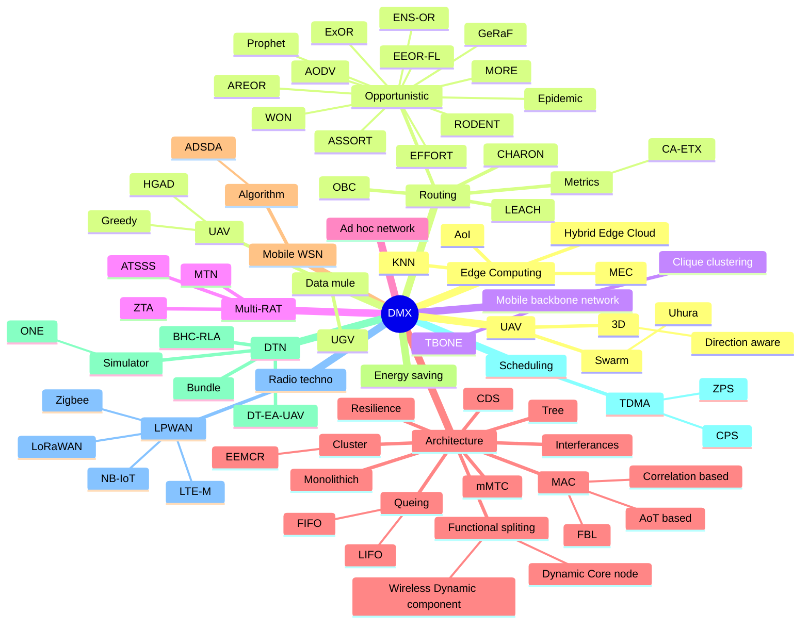

# Mind map

```mermaid
mindmap
  root((DMX))
    Edge Computing
      MEC
      AoI
      KNN
      Hybrid Edge Cloud

    Routing
      LEACH
      OBC
      CHARON
      Metrics
        CA-ETX
      Opportunistic
        ExOR
        MORE
        GeRaF
        WON
        EEOR-FL
        AODV
        AREOR
        ASSORT
        ENS-OR
        EFFORT
        Prophet
        Epidemic
        RODENT

    Mobile backbone network
      Clique clustering
      TBONE

    Multi-RAT
      ZTA
      MTN
      ATSSS

    Ad hoc network

    Architecture
      Queing
        FIFO
        LIFO
      Monolithich
      Functional spliting
        Dynamic Core node
        Wireless Dynamic component
      Resilience
      CDS
      Cluster
        EEMCR
      Tree
      Interferances
      mMTC
      MAC
        AoT based
        Correlation based
        FBL

    Mobile WSN
      Algorithm
        ADSDA

    Energy saving

    DTN
      DT-EA-UAV
      BHC-RLA
      Bundle
      Simulator
        ONE

    Scheduling
      TDMA
        CPS
        ZPS

    Radio techno
      LPWAN
        LTE-M
        Zigbee
        NB-IoT
        LoRaWAN

    UAV
      3D
        Direction aware
      Swarm
        Uhura

    Data mule
      UGV
      UAV
        HGAD
        Greedy
```
