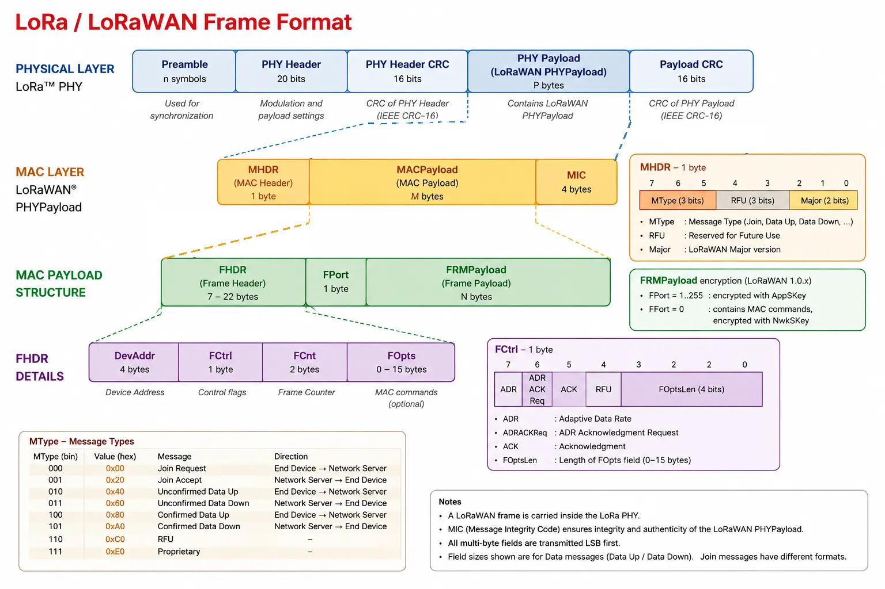

# LoRa and LoRaWAN

## LoRa

LoRa stand for Long Range. It's a **low power** and **long range** radiocommunication technique. It refers to the **physical layers**. LoRa is the radio signal that transmits the data over the air using a modulation called Chirp Spread Spectrum (CSS). It's a proprietary technology developed originally by the French start-up Cycléo in Grenoble in 2009 then acquire by US company [Semtech](https://semtech.fr) in 2012.

!!! warning

    “LoRa” is not short for “LoRaWAN”

## LoRaWAN

LoRaWAN stands for Long Range Wide Area Network. It defines the Media Access Control (MAC) and the network layer in top of LoRa. It handles the network architecture, device classes, frequency, security, adaptative data rate, message scheduling and acknowledgments and duty cycle. LoRaWAN is an open standard maintained by the [LoRa Alliance](https://lora-alliance.org/).

## Current issues

Whereas LoRa and LoRaWAN are mature, it remains issues. Here is a non-comprehensive list of them:

- **Scalability**: With the explosion of number of sensors in urban area the probability of packets collision increase drastically. Solution such as LR-FHSS (Long Range Frequency Hopping Spread Spectrum) or LBT (Listen-Before-Talk) are under studies.
- **Security**: Currently, LoRaWAN used AES-128 to encrypt data which is not post quantic. Moving to AES-256 could solve the problem but will drastically increase the CPU cost.
- **Maintainability**: It's possible to update firmware via FUOTA (Firmware Update Over The Air) but problems remains.
- **Satellites**: I could be interesting to add satellite connection, but problem appears such as Doppler effect with LEO satellite and intelligent handover between terrestrial network and NTN.
- **Edge computing and AI**: Reduce message to send using tiny ML model over sensor to do anomaly detection for example.
- **Zero-Power and energy harvesting**: The idea is to remove battery and to rely only on external source of power such as sun or vibration. That required an opportunistic protocol to send data when energy is available.

## Technical aspects

### Classes

In LoRaWAN, end-devices operate in one of three classes: A, B, or C. These classes define how devices communicate with and listen to the network. Class A is mandatory for all LoRaWAN devices, while Classes B and C are optional extensions.

#### Class A

The device opens two short reception windows (RX1 and RX2) only after transmitting a message. Outside of these windows, the device cannot receive any incoming messages. Class A is the most energy-efficient mode because continuously listening for downlink messages consumes significant battery power.

#### Class B

In addition to the standard RX1 and RX2 windows, the gateway regularly broadcasts a synchronization signal (a beacon). The device uses this beacon to open scheduled, periodic reception windows called Ping Slots. Class B consumes more power than Class A, but it enables reliable remote control with predictable latency on battery-powered devices.

#### Class C

The reception window is kept open almost continuously, closing only while the device is actively transmitting. This mode requires a constant power supply (typically mains power), but it offers near-zero latency for receiving commands or downlink data immediately.

### Spreading Factor (SF)

In LoRaWAN, the Spreading Factor (SF) represents a trade-off between communication range, energy consumption, and airtime. In standard LoRaWAN deployments, the Spreading Factor ranges from SF7 to SF12.

- SF7 offers the highest bitrate, resulting in the shortest time-on-air and the lowest energy consumption. However, its range is limited (typically around 2 km in urban environments).
- SF12 provides the maximum range and obstacle penetration, but yields the lowest bitrate and the longest time-on-air, consuming significantly more energy to transmit the same message.

Additionally, different Spreading Factors are orthogonal to one another. This means two devices transmitting simultaneously on the same frequency channel using different SFs will not interfere with each other.

!!! warning

    Spreading Factors are quasi-orthogonal rather than fully orthogonal. A high-power SF7 transmission from a nearby device can interfere with and mask (jam) a weak SF12 signal received from a distant device at the same time.

### Transmission Power (TX Power)

The Transmission Power defines the amount of energy, expressed in dBm, supplied to the antenna by the transmitter to send a message. In Europe, the signal power typically ranges between 2 dBm and 14 dBm (up to 25 mW). A higher transmission power provides better range and obstacle penetration, however, it requires significantly more energy, which can quickly drain battery-powered devices.

### Adaptative Data Rate (ADR)

An algorithm managed by the Network Server to dynamically optimize the data rate, Spreading Factor (SF), and transmission power of static LoRaWAN devices. The objective of ADR is to minimize device power consumption and optimize channel utilization across the network.

### Coding Rate (CR)

Coding rate is the ratio of Forward Error Correction (FEC) bits added to the payload. For example, a CR of 4/5 means that for every 4 payload bits, 1 error correction bit is added (making 5 total bits transmitted). A higher CR, such as 4/8, provides greater resilience against burst interference, though it increases the message duration (Time-on-Air).

### Bandwidth

Bantwidth is the range of frequencies over which the radio signal is transmitted (e.g., 125 kHz, 250 kHz, or 500 kHz). A higher bandwidth allows for higher throughput (data rate) but reduces receiver sensitivity. In LoRaWAN, bandwidth is strictly defined by regional parameters, so it cannot be freely selected.

### Uplink

In LoRaWAN, uplink refers to messages sent from the sensors (end-devices) to the network. This represents the vast majority of all network traffic.

### Downlink

In LoRaWAN, downlink refers to messages sent from the network to the sensors. It is used for control commands, acknowledgments (ACKs), network reconfigurations (such as ADR), and Firmware Updates Over-The-Air (FUOTA). Downlink traffic is kept to a minimum to conserve network capacity and device battery life.

### Security keys

#### AppKey

The Application Key is a root key unique to each end-device. In LoRaWAN 1.0.x, it is used during the Over-The-Air Activation (OTAA) join procedure to derive the session keys (AppSKey and NwkSKey) and to encrypt/decrypt the join-accept message.

#### NtwKey

The Network Key is a root key unique to each end-device. In LoRaWAN 1.1, it is used during the Over-The-Air Activation (OTAA) join procedure to derive the network session keys (FNwkSIntKey, SNwkSIntKey and NwkSEncKey).

#### LoRaWAN 1.0.x

In LoRaWAN 1.0.x, two session keys are derived from the AppKey during the join procedure: the AppSKey and the NwkSKey.

##### AppSKey

The Application Session Key is used to encrypt and decrypt the application payload (the actual data) exchanged between the end-device and the network server. It is derived from the AppKey during the OTAA join procedure.

##### NtwSKey

The Network Session Key is used to compute and verify the Message Integrity Code (MIC) of the frames exchanged between the end-device and the network server. It is derived from the AppKey during the OTAA join procedure.

#### LoRaWAN 1.1

In LoRaWAN 1.1, security is improved by splitting the network keys into three distinct session keys derived from the NwkKey: FNwkSIntKey, SNwkSIntKey and NwkSEncKey. The AppSKey is derived from the AppKey.

##### FNwkSIntKey (Forward Network Session Integrity Key)

The Forward Network Session Integrity Key is used to compute and verify the Message Integrity Code (MIC) of uplink frames sent by the end-device to the network server. It is derived from the NwkKey during the OTAA join procedure.

##### SNwkSIntKey (Serving Network Session Integrity Key)

The Serving Network Session Integrity Key is used to compute and verify the Message Integrity Code (MIC) of downlink frames sent by the network server to the end-device. It is derived from the NwkKey during the OTAA join procedure.

##### NwkSEncKey (Network Session Encryption Key)

The Network Session Encryption Key is used to encrypt and decrypt the MAC commands (network management data) exchanged between the end-device and the network server. It is derived from the NwkKey during the OTAA join procedure.

##### AppSKey (Application Session Key)

The Application Session Key is used to encrypt and decrypt the application payload (the actual data) exchanged between the end-device and the application server. It is derived from the AppKey during the OTAA join procedure.

### Architecture and network components

#### Gateway (GW)

A radio hardware device acting as a transparent bridge. It receives radio messages transmitted by nearby End-Devices and forwards them to the Network Server via a standard IP connection (4G, Ethernet, Wi-Fi), and vice versa for downlink messages.

#### Network Server (NS)

The core of the LoRaWAN network. It removes duplicated frames received by multiple gateways, monitors link quality, manages Adaptive Data Rate (ADR), verifies message integrity, and routes data to the appropriate Application Server. To verify message integrity and decrypt MAC commands, Networks server owns NwkSKey.

#### Application Server (AS)

A server hosting the user's application and business logic. It receives the encrypted payload, decrypts it for data processing (dashboards, databases), and manages command transmissions back to devices. To decrypt the encrypted payload, the Application Server owns AppSKey.

#### Join Server (JS)

A security component responsible for authenticating devices during the Over-The-Air Activation (OTAA) process. It verifies device identity and generates the session keys required for encrypted communications. It owns root keys namely AppKey and NwkKey

#### Location Server / Geolocation Server

A specialized server that calculates a sensor's geographic position by analyzing radio metadata (such as Time Difference of Arrival or RSSI signal strength) collected across multiple gateways, enabling positioning without power-hungry GPS hardware.

### Frame fields

A LoRaWAN frame is structured in different layer

#### Payload

Payload is the part of a message that contains the actual data being transported, excluding protocol headers and control information. In LoRaWAN, the term “payload” can be ambiguous, as its meaning depends on the protocol layer, such as the physical payload (PHYPayload), MACPayload, or FRMPayload.

#### MHDR (MAC Header)

MHDR (MAC Header) is the first field of a LoRaWAN frame. It contains 1 byte of information about the message type and the LoRaWAN frame format version. More specifically it contains MType, RFU and Major

##### MType (Message Type)

MType stands for Message Type. It is a 3-bit field in the MAC header of a LoRaWAN packet. It indicates the type of LoRaWAN message being transmitted, such as a Join Request, Join Accept, Unconfirmed Data Up, or Confirmed Data Up.

##### RFU (Reserved for Future Use)

##### Major

Major LoRaWAN version number

#### MACPayload (MAC Payload)

#### FHDR (Frame Header)

It is the part of the MAC frame that contains the information required to identify the device and manage the frame. It contains the **DevAddr, FCtrl, FCnt, and FOpts** fields.

##### DevAddr (Device Address)

DevAddr is a 32-bit network address used to identify a device within a LoRaWAN network. It consists of a NwkID and a NwkAddr. Unlike DevEUI, DevAddr is not a permanent device identifier.

##### FCtrl (Frame Control)

FCtrl is a field of the FHDR that contains control information used to manage the LoRaWAN frame, such as ADR, acknowledgments, and the length of FOpts.

##### FCnt (Frame Counter)

FCnt (Frame Counter) is a field in the FHDR used to count uplink and downlink frames. It helps prevent replay attacks and maintain synchronization between the device and the network.

##### FOpts (Frame Options)

FOpts is an optional field of the FHDR used to carry MAC commands. Its length is specified by the FOptsLen field in FCtrl and can be up to 15 bytes.

#### FPort (Frame Port)

FPort is a field used to specify which application the FRMPayload is addressed to.

#### FRMPayload (Frame payload)

#### MIC (Message Integrity Code)

The Message Integrity Code (MIC) is a cryptographic value used to verify the integrity and authenticity of a LoRaWAN message. It is computed using AES-CMAC as specified in RFC 4493. The key(s) used to compute the MIC depends on the LoRaWAN version and the message type (MType).

#### Join identifiers

##### Device EUI (DevEUI)

The Device Extended Unique Identifier (DevEUI) is a 64-bit (8-byte) globally unique identifier used to uniquely identify a LoRaWAN device. It is primarily used during the OTAA (Over-The-Air Activation) procedure.

##### Join EUI (JoinEUI)

The Join Extended Unique Identifier (JoinEUI) is a 64-bit (8-byte) identifier that identifies the Join Server or entity with which a LoRaWAN device is associated for the join procedure. It is included in the Join-request message during OTAA.
